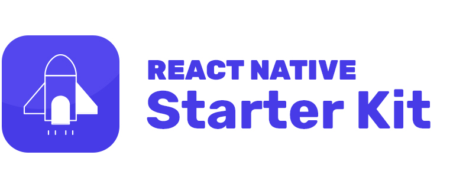

  
  

  <h1>SmartAssist</h1>
  <h2>A propos de smartAssit</h2>
  
C'est une plate forme d'assistance des étudiants proposant des différent modules suivant

  <ul>
    <li><b>Préinscription</b> Dans cette rubrique le robot guide l'étudant dans le processus de préinscription et à la fin lui génère une fiche de préinscription</li>
    <li><b>Orientation scolaire</b>Ici le robot ce charge d'orienter l'étudiant en lui donnant les débouchés des différentes filières en fontion du diplôme de l'étudiant</li>
    <li><b>Parainage</b> Ici le robt procure des conseils à l'étudiant afin de pouvoir l'accompagner durant son cycle à l'université</li>
  </ul>
   
  <h2>Installation</h2>
  
Tous d'abord il faut installer l'environnement react-native dans votre machine

  
Après avoir cloné le projet il faut

  <ul>
    <li>Installer les dépendances avec un gestionnaire de dépendance <i>yarn</i> ou <i>npm</i></li>
    <li>Démarrer le serveur avec la commande <i>npm start</i> ou <i>yarn start</i></li>
    <li>connecter le téléphone à l'ordinateur et taper la commande <i>npm run android</i>. Rassurez vous que le mode développeur est activé sur votre appareil ainsi que le débogage usb</li>
  </ul>
   

